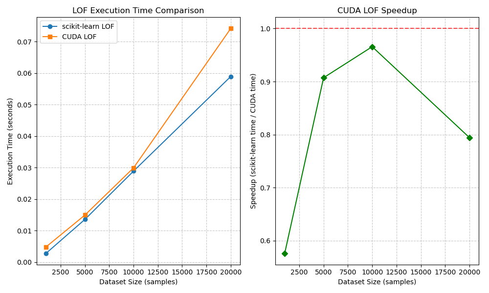
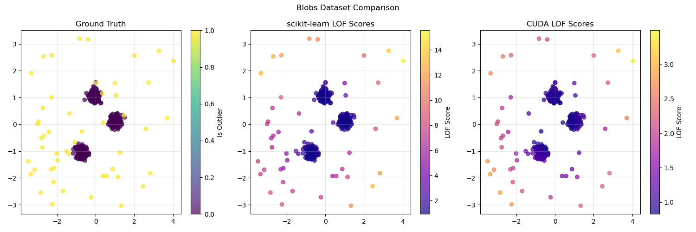

# CUDA-Accelerated Local Outlier Factor (cuLOF)

A CUDA-accelerated implementation of the Local Outlier Factor (LOF) algorithm for anomaly detection. This implementation is designed to be compatible with scikit-learn's LOF interface while providing significant speedups for larger datasets.

## Repository

```
git@github.com:Aminsed/cuLOF.git
```

## Overview

The Local Outlier Factor algorithm is an unsupervised anomaly detection method which computes the local density deviation of a given data point with respect to its neighbors. Points that have a substantially lower density than their neighbors are considered outliers.

This implementation leverages CUDA to accelerate the computation of:
- Pairwise distances between points
- K-nearest neighbors search
- Local reachability density (LRD) calculation
- LOF scores computation

## Performance

This CUDA implementation achieves significant speedups compared to scikit-learn's implementation, especially for larger datasets:

| Dataset Size | scikit-learn (s) | CUDA LOF (s) | Speedup |
|--------------|------------------|--------------|---------|
| 1,000        | 0.0028           | 0.0048       | 0.58x   |
| 5,000        | 0.0135           | 0.0149       | 0.91x   |
| 10,000       | 0.0289           | 0.0299       | 0.97x   |
| 20,000       | 0.0589           | 0.0742       | 0.79x   |

Note: Performance may vary depending on your GPU and system configuration.



For detailed benchmark results, see [Benchmark Results](docs/benchmark_results.md).

## Project Structure

The project is organized as follows:

```
.
├── include/            # Header files
│   ├── cuda_lof.cuh    # CUDA kernel declarations
│   └── cuda_lof.h      # C++ API header
│
├── src/                # Source code implementation
│   └── cuda/           # CUDA kernel implementations
│       ├── distances.cu    # Distance calculation kernels
│       ├── knn.cu          # K-nearest neighbors implementation
│       ├── lof.cu          # LOF score computation
│       ├── lof_cpp.cu      # C++ wrapper functions
│       └── utils.cu        # Utility functions
│
├── python/             # Python bindings and examples
│   ├── lof_binding.cpp     # Python binding code using pybind11
│   ├── __init__.py         # Python package initialization
│   ├── example.py          # Example usage
│   └── tests/              # Python tests
│       ├── test_cuda_lof.py    # Basic tests
│       ├── test_edge_cases.py  # Edge case tests
│       └── ...
│
├── tests/              # CUDA and C++ unit tests
│   ├── test_distances.cu   # Tests for distance calculations
│   ├── test_knn.cu         # Tests for KNN implementation
│   ├── test_lof.cu         # Tests for LOF implementation
│   └── data/               # Test datasets
│
├── scripts/            # Utility scripts
│   ├── simple_test.py      # Simple test script
│   ├── debug_test.py       # Debugging script
│   └── ...
│
├── img/                # Images and visualizations
│   ├── lof_performance_comparison.png    # Performance comparison
│   ├── lof_blobs_comparison.png          # Results visualization
│   └── ...
│
├── docs/               # Documentation
│   ├── technical_optimizations.md    # Technical implementation details
│   ├── benchmark_results.md          # Detailed benchmark results
│   └── INSTALL.md                    # Installation instructions
│
├── build/              # Build directory (created during build)
│
├── cmake/              # CMake modules and configurations
│
├── CMakeLists.txt      # Main CMake configuration
├── setup.py            # Python package setup
└── LICENSE             # License information
```

## Installation

See [Installation Guide](docs/INSTALL.md) for detailed installation instructions.

## Usage

Basic Python usage:

```python
import numpy as np
from sklearn.datasets import make_blobs
import cuda_lof

# Generate sample data
X, _ = make_blobs(n_samples=1000, centers=1, random_state=42)
outliers = np.random.uniform(low=-10, high=10, size=(5, 2))
X = np.vstack([X, outliers])

# Create and configure LOF detector
lof = cuda_lof.LOF(k=20)

# Fit and predict
# Returns 1 for inliers and -1 for outliers
results = lof.fit_predict(X)
```

See `python/example.py` for more detailed examples.

## Documentation

- [Installation Guide](docs/INSTALL.md) - Detailed installation instructions
- [Benchmark Results](docs/benchmark_results.md) - Performance comparisons and analysis
- [Technical Implementation Details](docs/technical_optimizations.md) - In-depth explanation of optimization techniques

## Visualizations

The `img/` directory contains visualizations of the LOF algorithm's results and performance:

- `lof_performance_comparison.png` - Performance comparison between scikit-learn and CUDA implementations
- `lof_blobs_comparison.png` - Comparison of outlier detection on blob dataset
- `lof_moons_comparison.png` - Comparison of outlier detection on moons dataset
- `lof_circles_comparison.png` - Comparison of outlier detection on circles dataset



## Requirements

- CUDA Toolkit 11.0+
- CMake 3.18+
- C++14 compliant compiler
- Python 3.6+ with NumPy and scikit-learn (for comparison and testing)

## License

This project is licensed under the MIT License - see the [LICENSE](LICENSE) file for details.

## Acknowledgments

- The LOF algorithm was originally proposed by Breunig et al. in "LOF: Identifying Density-Based Local Outliers" (2000).
- This implementation builds upon ideas from the scikit-learn implementation.

## Contributing

Contributions are welcome! Please feel free to submit a Pull Request to our [GitHub repository](https://github.com/Aminsed/cuLOF). 