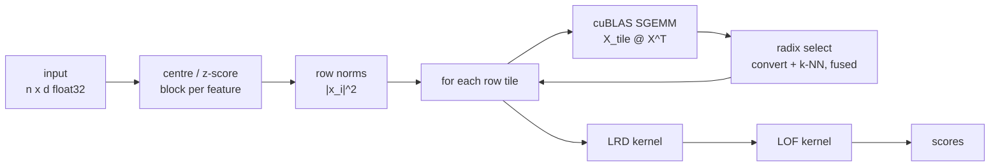

# How cuLOF works

The Local Outlier Factor of a point compares the density of its own
neighbourhood with the density of its neighbours' neighbourhoods. Following
Breunig et al. (2000), for a point $p$ with $k$ nearest neighbours $N_k(p)$:

```
k-distance(p)        = distance from p to its k-th nearest neighbour
reach-dist_k(p, o)   = max(k-distance(o), d(p, o))
lrd_k(p)             = 1 / (mean_{o in N_k(p)} reach-dist_k(p, o))
LOF_k(p)             = mean_{o in N_k(p)} lrd_k(o) / lrd_k(p)
```

A score near 1.0 means the point is about as densely surrounded as its
neighbours. Substantially above 1.0 means it sits in a sparser region than they
do, which is what makes it an outlier candidate.

## Pipeline



## Distances

Pairwise squared distances come from the expansion

$$\|a-b\|^2 = \|a\|^2 + \|b\|^2 - 2\,a \cdot b$$

so the $O(n^2 d)$ work becomes a single SGEMM, which on an A6000 runs at a large
fraction of peak FP32 rather than the few percent a hand-written distance loop
achieves.

The expansion has a known weakness: when $\|a\|^2$ is large relative to
$\|a-b\|^2$ the subtraction cancels and significant digits are lost. cuLOF
always **centres the data** first. Centring does not change any distance, but it
makes $\|a\|^2$ as small as it can be, which is precisely the term driving the
cancellation. `tests/python/test_regressions.py::test_far_from_origin_is_numerically_stable`
pins this down at an offset of 5000, where the naive expansion would lose most
of its precision.

## Selecting the k nearest neighbours

LOF needs the neighbour **set** and the **k-distance**. It never needs the
neighbours in sorted order — every downstream quantity is a mean over the set.
So cuLOF selects rather than sorts.

Selection is an MSB-first **radix select** on the raw float bits. For
non-negative IEEE-754 floats the unsigned integer ordering of the bit pattern is
identical to the numeric ordering, so an integer radix select on
`__float_as_uint(d)` is exact. Squared distances are non-negative by
construction, and a point's own column is set to `+inf`, so a point can never
select itself.

Three passes of 11, 11 and 10 bits pin down the k-th smallest key exactly. A
final pass gathers the neighbours: everything strictly below the k-th key, plus
as many entries equal to it as are needed to reach exactly k.

This replaces the earlier per-thread insertion sort, and the differences matter:

| | insertion sort per thread | radix select per block |
|---|---|---|
| max k | 32 (fixed register array) | unbounded |
| work per row | O(n·k) | O(n) per pass |
| memory access | one thread walks a row, stride-n across threads | a block sweeps a row, fully coalesced |

Two things keep memory traffic down, which is what this kernel is limited by:

- The **Gram-to-distance conversion is fused into the first radix pass**. The
  tile is produced and histogrammed in one sweep instead of by a separate
  elementwise kernel.
- **11-bit digits** cover 32 bits in three passes rather than the four an 8-bit
  digit would need.

Together that is four sweeps of the tile instead of six.

## Determinism

The gather phase assigns output slots with a block-wide prefix sum rather than
`atomicAdd`. Atomics would emit the neighbour list in a different order on every
launch, and since floating-point addition is not associative, that alone would
make the last bits of the scores move between runs. With the scan, a given input
and configuration produces bitwise-identical scores every time.

Tile height is the one thing that does change the last bit: cuBLAS selects a
different SGEMM kernel depending on the tile shape, which reorders the
dot-product accumulation. Results across tile heights agree to a few ULP, not
bit for bit. Both properties are asserted in the test suite.

## Memory

Persistent allocations are $O(nk)$:

| buffer | size |
|---|---|
| points | n · d · 4 B |
| neighbour indices + distances | 2 · n · k · 4 B |
| norms, k-distances, LRD, scores | 4 · n · 4 B |
| distance tile (scratch) | tile_rows · n · 4 B |

The distance matrix is never materialised in full. Rows are processed in tiles
sized to fit a budget of at most 2 GiB of free device memory, so peak usage
grows linearly in $n$ rather than quadratically. For reference, a dense
200,000 × 200,000 float32 matrix would be 149 GiB.

`CULOF_TILE_ROWS` overrides the automatic tile height. It exists so the tests can
prove tiling does not change the answer, and gives users a lever when sharing a
GPU.

## Numerical agreement with scikit-learn

cuLOF computes distances in float32; scikit-learn computes in float64. For the
overwhelming majority of points the two agree to float32 rounding — median
relative difference 4.5·10⁻⁷ and 99th percentile 2.4·10⁻⁶ at n = 20,000.

The exception is points whose k-th and (k+1)-th neighbours are closer together
than float32 can resolve. There, which neighbour is "the k-th" is genuinely
ambiguous, the two libraries can pick differently, and that point's score can
differ by up to about 1%. At n = 20,000 this affects 0.27% of points. It
does not affect the outlier ranking: the top 1% of scores is identical in every
benchmarked configuration.

`tests/python/test_parity.py::test_near_ties_are_the_only_disagreement`
asserts exactly this: the bulk agrees tightly, disagreements are rare, every
disagreeing point is on a near-tie, and the ranking is unchanged.

## Why brute force, and why the speedup narrows

cuLOF computes all $n^2$ distances. scikit-learn uses a KD-tree or ball-tree in
low dimensions, which never examines most pairs. These are **not the same
algorithm**, and that governs how the comparison scales.

Fitting the measured timings in the range where both are past their fixed
overheads:

| | measured scaling |
|---|---|
| cuLOF, brute force | $n^{2.01}$ |
| scikit-learn, KD-tree (d = 8) | $n^{1.13}$ |

So the ratio decays as $n^{-0.7}$. A constant-factor hardware advantage, however
large, always loses to a better asymptotic complexity eventually. Over
50,000 → 200,000 that predicts a $4^{0.7} = 2.6\times$ fall in speedup; the
measured fall is $2.59\times$. The narrowing is arithmetic, not a GPU running out
of headroom.

The prediction that follows is the useful one: it should be a **low-dimensional**
effect only. KD-trees lose their advantage as dimensionality rises — the curse of
dimensionality — and scikit-learn switches to a BLAS brute-force path. Then both
sides are $O(n^2 d)$ and the ratio should stop decaying. It does:

| n | speedup at d = 8 | speedup at d = 128 |
|---:|---:|---:|
| 5,000 | 32× | 15× |
| 10,000 | 37× | 15× |
| 20,000 | 30× | 13× |
| 50,000 | 32× | 16× |
| 100,000 | **21×** | **17×** |

At d = 128 both implementations scale as $n^{1.9}$ and the ratio is flat, even
rising slightly as the GPU saturates.

Read together: **~15× is the honest steady-state hardware win**, sustained at any
n once the algorithms match. The 30–60× seen at low dimensionality is larger
partly because scikit-learn is paying tree-construction and Python overhead that
cuLOF does not have, and it erodes at large n because the tree is genuinely doing
less work.

Closing the low-dimensional gap would mean giving up exactness — an approximate
or indexed neighbour search such as IVF — which is a different library with a
different contract. cuLOF returns the same neighbours scikit-learn does.
